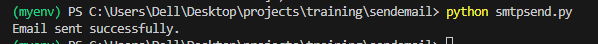

# Automating Email Send via SMTP
### Case Study of Microsoft 365 

- [x] To run this project successfull ensure your sender account if it has MFA configured them Create App  Password
- [x] Disable Security Defaults on Microsoft 365 Entra > Indentity > Properties

```powershell
Set-ExecutionPolicy -ExecutionPolicy RemoteSigned -Scope CurrentUser
```

Set Up Python VENV

```python

python -m venv myenv
.\Scripts\activate.ps1   

```

On Powershell Set Env Variable 

```
$env:EMAIL_PASSWORD = "your_password_here"
```
Run the Python File

```
python smtpsend.py
```

## Variables - Enter Yours

`smtp_server` and `smtp_port`: Set these variables to the appropriate SMTP server and port of your email provider.

`sender_email`: Specify the email address from which you want to send the email.

`sender_password`: Provide the password or an app-specific password for the sender's email account.

`recipient_email`: Specify the recipient's email address.

`subject`: Set the subject line of the email.

`message`: Provide the content or body of the email.

### Image of Successfull Run

